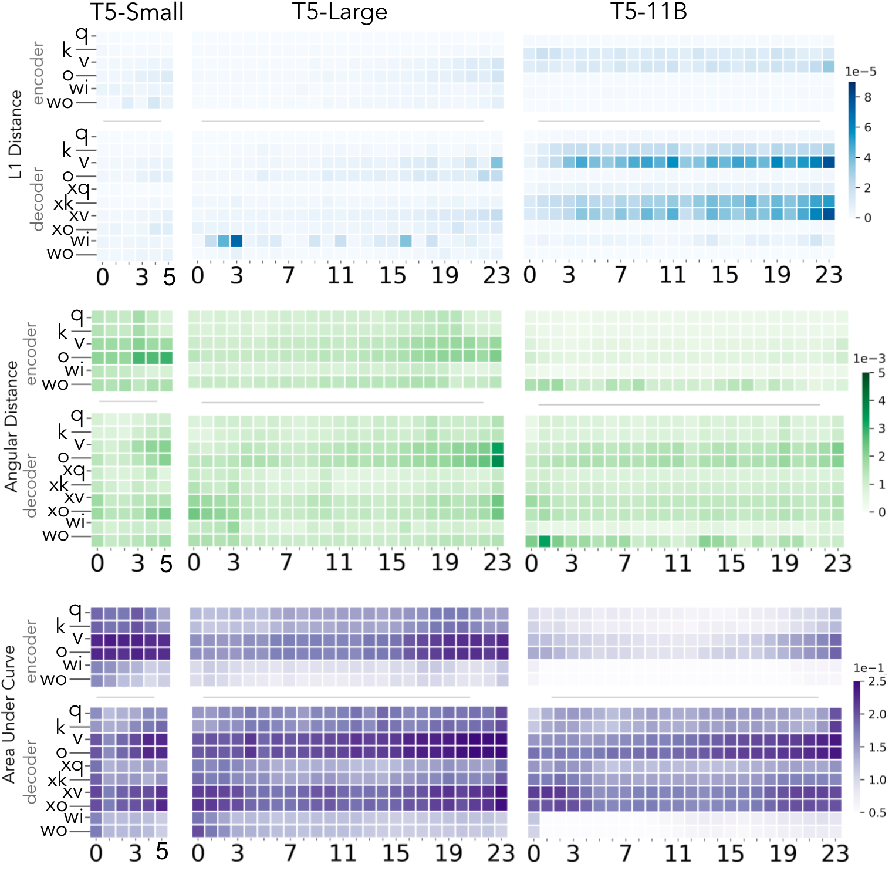

# Calculating Weight Differences in Transformers

This repo contains code to calculate weight difference before and after fine-tuning in Transformers (e.g. from HuggingFace).

### Setup

For setup, run `pip install requirements.txt`. This repo requires `python 3.6` or higher.

In addition, you'll need a fine-tuned model file to compare to. For an example, the model uses the pretrained (without extra fine-tuning) T5 model. You can use your own fine-tuned model, or download a COMET model file from `https://github.com/allenai/few-shot-comet`.

### Running Difference Calculation

The following is an example of getting difference calculation running for a T5-COMET model.

(1) Place a model folder in a local directory, for example, in `./fine-tuned-t5`

(2) Run `calculate_differences.py` with appropriate parameters:

- `calculate_differences.py --model_name t5 --model_folder ./fine-tuned-t5 --model_size large --function_type l1`

(3) (Optional) Create a heatmap with the weights produced from the model, for example, using `heatmap/heatmaps.py`

### Adding your own model

To add a new model type to this script, you'll need to modify `model_constants.py` with the information for your model.

- `MODELS_TO_LAYERS` will need to be updated with the number of layers for the model of the given size.
- `MODELS_TO_STORE` will need to be updated with maps of the model config to the name of the weights stored in the model. An example is provided for T5, which uses both an encoder and a decoder.

### Notes

- For public inquiries, please create a GitHub issue with questions and suggestions. We suggest that you create a pull request instead of an issue for fixes and updates.
- Please contact jeffd@allenai.org for any private inquiries.

### License
This work is under the Apache 2.0 license.